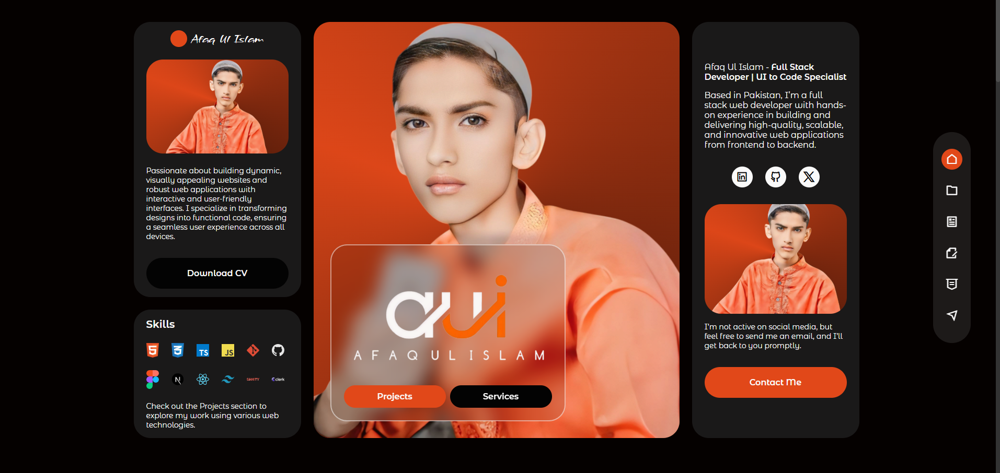

# 🚀 AUI — Afaq Ul Islam Portfolio Website | Frontend Developer

## 🖼️ Preview

---

## 🌐 Overview

A fully responsive and visually appealing portfolio website developed using **HTML5, CSS3, and Vanilla JavaScript**. This project highlights my frontend development expertise — translating UI/UX designs into clean, performant, and interactive web interfaces.

---

## ✨ Key Features

- 🎨 **Pixel-Perfect Design Implementation** — Converts Figma/Adobe XD designs into pixel-perfect web layouts
- 🌗 **Dark Mode Support** — Sleek dark theme with modern visual aesthetics
- 📱 **Mobile-First Design** — Optimized for all screen sizes with a responsive layout strategy
- 🧱 **Smooth Scroll Animations** — Enhances user experience with subtle animations
- 📬 **Contact Form Integration** — Email functionality powered by [EmailJS](https://www.emailjs.com/)
- 🛠️ **Customizable UI** — Easily change theme colors and content for personal branding
- 🔍 **SEO Friendly** — Clean code structure and best practices for discoverability

---

## 🧑‍💻 Tech Stack

- **HTML5**
- **CSS3**
- **JavaScript (ES6+)**

---

## 🔗 Live Demo

👉 [View Portfolio Live](https://aui-portfolio.vercel.app/)

---
